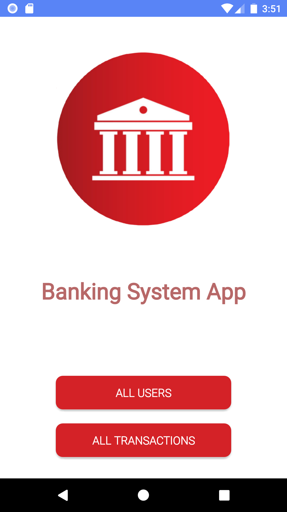
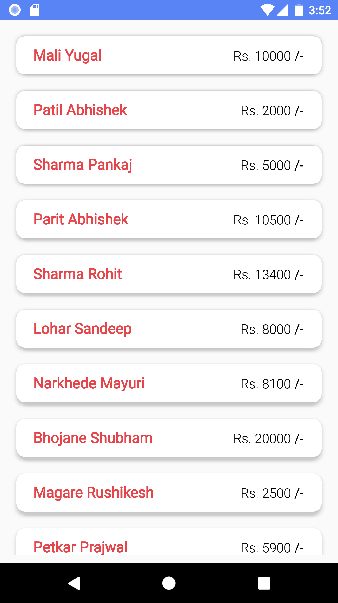
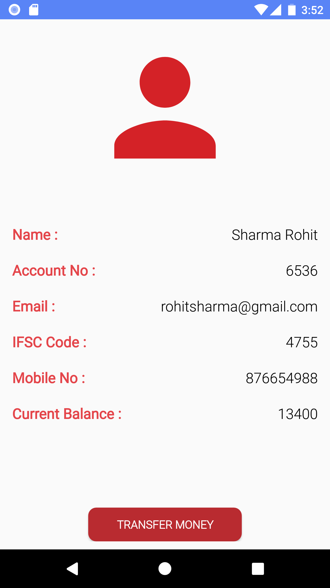
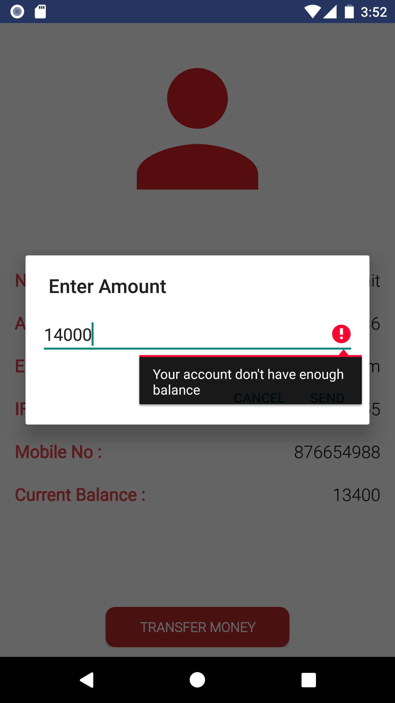
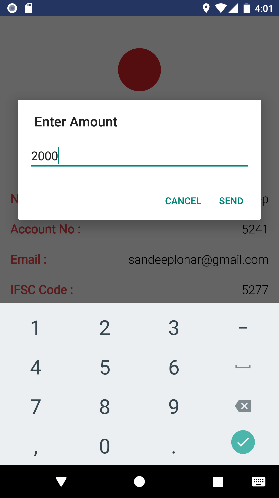
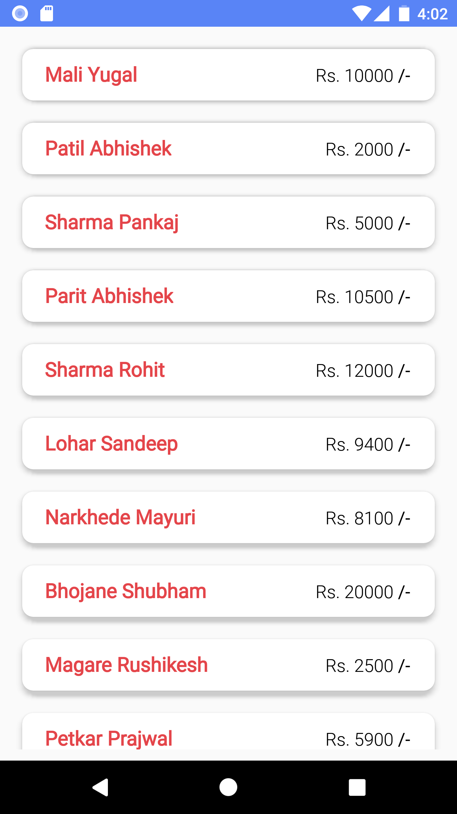
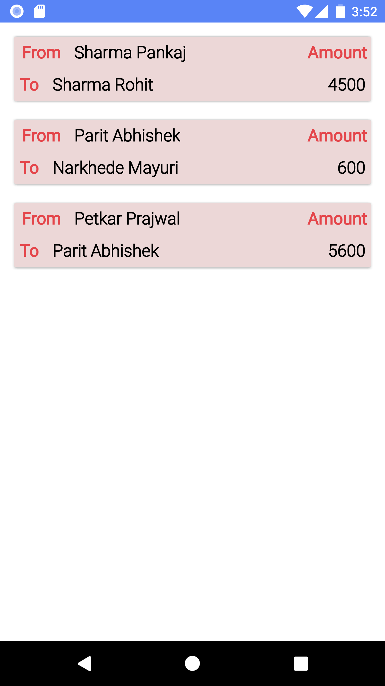
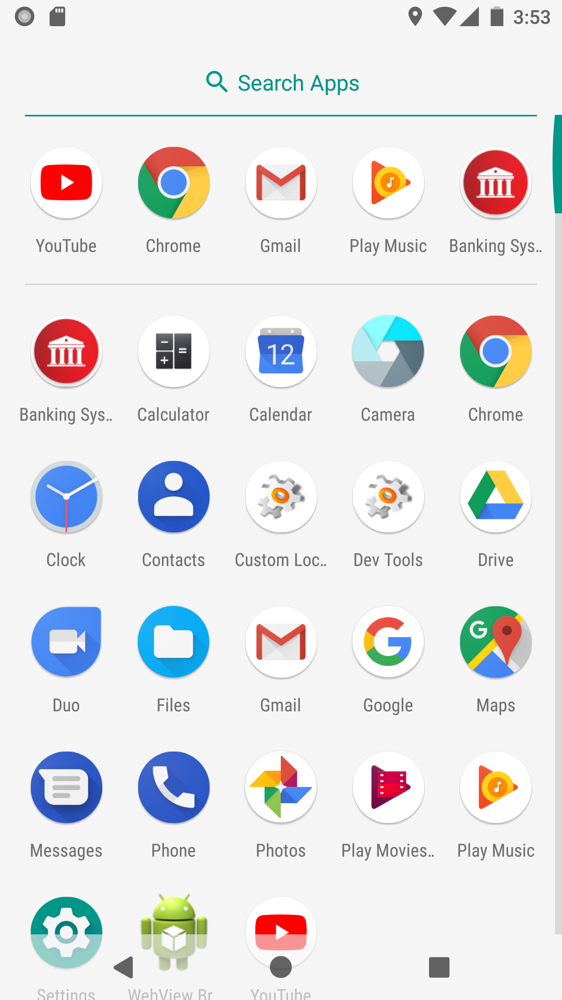

# BasicBankingApp
## Description
* Banking System App which keeps track of its user's and their transaction history.
* Uses MYSQLite for Database storage.

## Screenshots
### HomeScreen

### Users List

### Users Data

### Transfer Amount
  

### Select User To Transfer Money

### Transaction Successful

### Updated Amount In Users List

### Transaction History Showing Successfull & Cancelled Transactions

### Project Explanation
